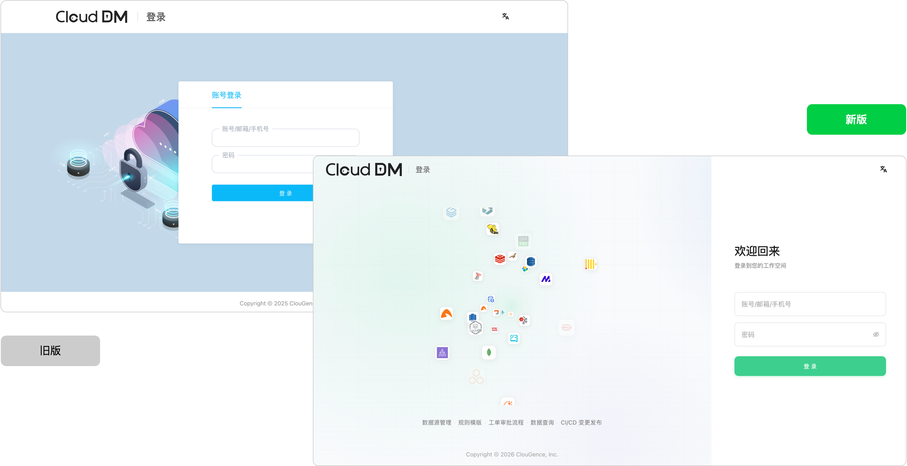
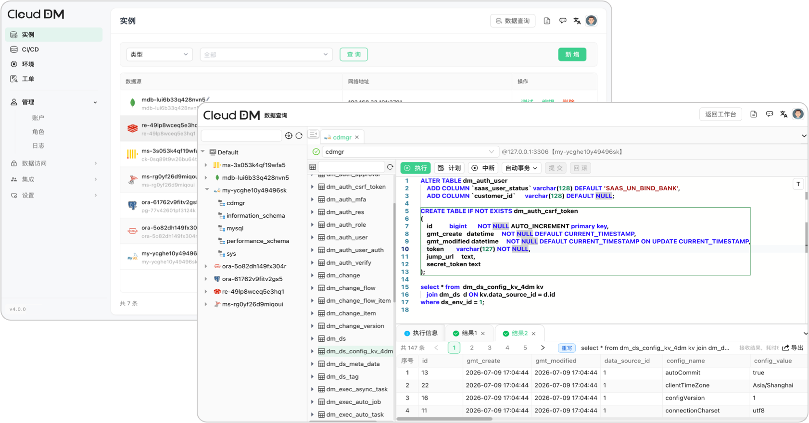
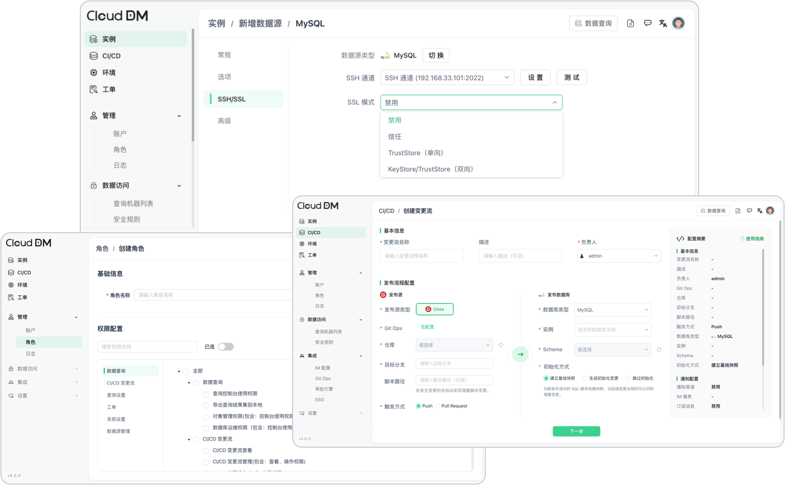

## 亮点

- 全新界面与交互体验：优化数据源、权限、安全和 CI/CD 等核心页面。

  

- SQL 查询与工作流程分离：开发查询与审批、工单流程互不干扰。

  

- 功能持续增强：支持 SSH 隧道、SSL 证书、代理、SSO、审批及多途径登录。

  

## 新增

- 新增 SSH 隧道管理，包括 SSH 配置页面、密码、私钥、代理、`known_hosts` 探测和连接测试。
- 新增数据源安全连接配置，支持 SSL 证书和 HTTP、SOCKS4、SOCKS5 代理。
- 新增 SSO 认证提供商和审批引擎独立配置页面，支持 LDAP、AD、OIDC、钉钉、飞书、微信、企业微信等集成统一管理。
- 新增 SQL 审计日志保存天数设置入口。
- 新增 JDK 17 支持和 Docker 多架构打包。
- 新增集成配置文档入口，方便在 IM、Git、SSO、审批表单中查看对接说明。

## 优化

- 优化数据源配置模型、存储结构和创建、编辑流程，提升插件化配置能力。
- 优化安全规则工作流和角色管理 UI。
- 优化数据源创建、编辑流程，统一为所有数据源提供测试连接能力。
- 优化登录与认证体验，包括 OIDC 登录流程和响应式布局。
- 优化操作审计列表和导出，支持插件化导出格式、全量和限行导出、流式进度推送。
- 优化 CI/CD 工单流程页面和搜索体验。
- 移除初始化阶段的驱动下载流程，首次部署更简单。

## 修复

- 修复 Oracle、PostgreSQL、Greenplum、Redis、SQL Server 等数据源配置、驱动加载、内置驱动打包和连接配置问题。
- 修复 SQL 工作台查询加载、数据源树展开状态和数据库元数据初始化问题。
- 修复权限、角色、工单、审批调度和数据源创建者授权相关问题。
- 修复单机版修改服务端口后启动不生效的问题。
- 修复 Oracle 11g 连接发生 ORA-01882 时区错误的问题。
- 修复添加阿里云 ADB 数据源失败的问题。
- 修复读取配置和初始化升级向导 UI 问题。
